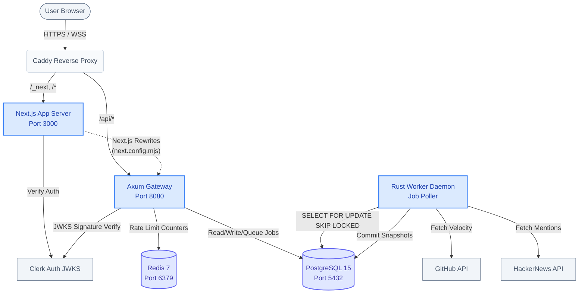
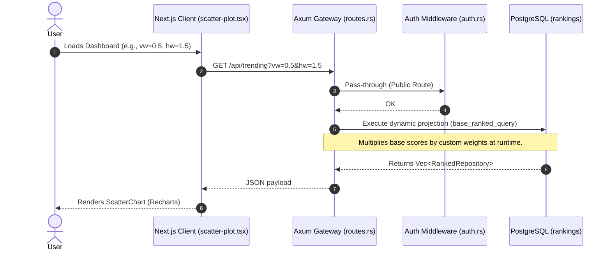
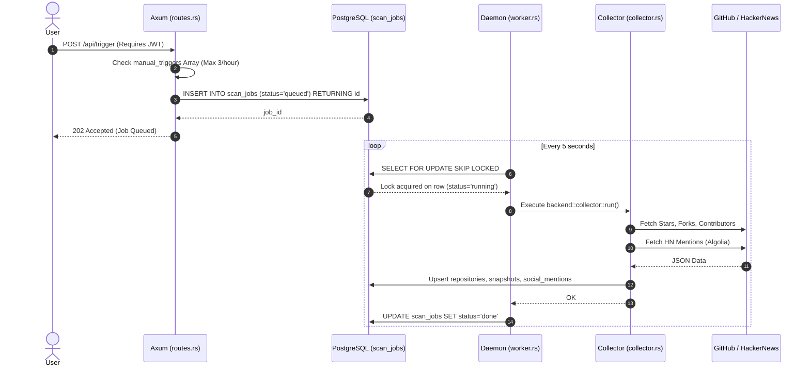
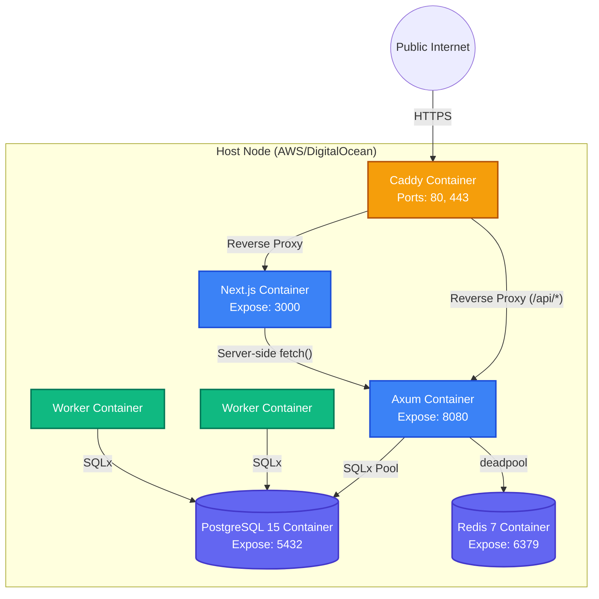

# System Architecture

This document details the architectural topology, data flow, and request lifecycles of TrackOpenSource. The system is designed around a decoupled producer-consumer model where lightweight Next.js clients communicate with a Rust/Axum gateway, which in turn offloads heavy ingestion tasks to asynchronous background workers via PostgreSQL row-locking.

## 1. High-Level Architecture

The platform operates across four primary distinct environments:

1. **Client Presentation (Next.js)**: Server-side rendered React application with `use client` visual charting boundaries.
2. **REST API Gateway (Axum)**: Rust-based HTTP entrypoint handling authentication, rate-limiting, and dynamic SQL query execution.
3. **Background Daemon (Rust)**: Isolated worker process running an infinite `FOR UPDATE SKIP LOCKED` task polling loop.
4. **Data Persistence (PostgreSQL + Redis)**: Primary relational store acting as both the application ledger and the inter-process message broker. Redis handles ephemeral rate-limiting counters.

## 2. Frontend/Backend Communication

Frontend and backend communication bridges across Next.js and Rust using standard HTTP protocols secured by Clerk JWTs and API keys.

*   **Proxying (CORS Bypass):** As defined in `frontend/next.config.mjs`, requests to `/api/*` on the Next.js dev server are rewritten to `http://localhost:8080/api/*`. In production (`Caddyfile`), Caddy routes `/api/*` directly to the Rust container.
*   **Authentication (JWT):** The frontend relies on Clerk (`frontend/src/middleware.ts`) to manage sessions. When making authenticated requests (e.g., `POST /api/trigger` in `scan-trigger.tsx`), the frontend attaches a `Bearer` token. The backend (`backend/src/auth.rs`) decodes this via `jsonwebtoken` against Clerk's public PEM key.
*   **Programmatic Access:** External developers use API keys (e.g., `osr_xyz`). The backend `backend/src/api_auth.rs` extracts the `x-api-key` header, hashes it with SHA-256, verifies it in PostgreSQL, and increments a rate-limit counter in Redis.

## 3. Request Flow: The Query Pipeline (Synchronous)

When a user loads the dashboard, the Next.js client requests the trending repositories. The backend executes a complex dynamic SQL projection rather than relying on materialized views, allowing runtime weight adjustments (`vw`, `hw`, `sw`).

**Implementation references:**
*   `frontend/src/components/dashboard-client.tsx`
*   `backend/src/routes.rs` -> `trending()`
*   `backend/src/routes.rs` -> `base_ranked_query()`

## 4. Data Flow: The Ingestion Pipeline (Asynchronous)

Data collection is entirely decoupled from user requests. Users can queue a "Scan" job, but the actual HTTP scraping is handled by the background daemon to protect the web server from thread starvation and API rate limits.

**Implementation references:**
*   `backend/src/bin/worker.rs` (Daemon loop)
*   `backend/src/collector.rs` (GitHub scraping logic)
*   `backend/src/hacker_news.rs` (Algolia fetching)
*   `backend/src/jobs.rs` (Hiring thread tokenization)

## 5. Deployment Architecture

TrackOpenSource uses a containerized deployment model managed via Docker Compose (`docker-compose.prod.yml`). The production stack operates within a private Docker network bridge, ensuring internal services (like the database and backend) are never exposed directly to the public internet.

**Deployment specific notes:**
*   **Horizontal Scaling:** The worker daemon is stateless. As shown in the diagram, `Worker1` and `Worker2` can run simultaneously. Because they use `FOR UPDATE SKIP LOCKED` on the `scan_jobs` table, they will never process the same job twice.
*   **Rate Limit Data:** The Redis container is explicitly used to track ephemeral rate-limiting sliding windows (e.g., `rate_limit:api_key:{user_id}`). If Redis crashes, the API fails-closed (returns `500`).
*   **Static Assets:** Handled internally by Next.js's standalone output server (`server.js`), not offloaded to Caddy.
