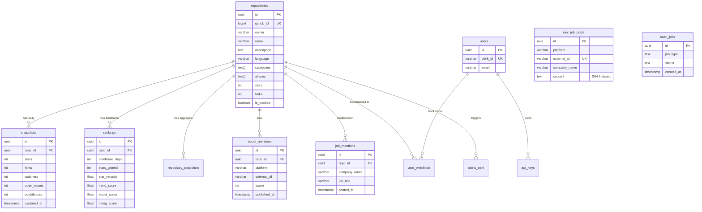

# Database Schema


TrackOpenSource relies on PostgreSQL 15 as its primary data store, acting as both the analytical ledger and the task coordination queue. The schema is relational, utilizing `UUIDv4` primary keys across all tables.

## Entity-Relationship Diagram



## Table Definitions

### `repositories`
The canonical registry of all tracked open-source projects.
*   **`id`** (UUID, PK): Unique identifier.
*   **`github_id`** (BIGINT, Unique): GitHub's internal repository ID.
*   **`owner`** (VARCHAR): GitHub organization or username.
*   **`name`** (VARCHAR): Repository name.
*   **`categories`** (TEXT[]): Array of classifications (e.g., "AI", "Database").
*   **`aliases`** (TEXT[]): Shorthand names used by the Alias Engine (e.g., `['k8s']` for Kubernetes) for full-text search matching against job posts.
*   **`is_tracked`** (BOOLEAN): If true, the worker daemon actively scrapes this repository.

### `snapshots`
The "Time Machine" table. Records daily point-in-time metrics for every tracked repository.
*   **`repo_id`** (UUID, FK): References `repositories`.
*   **`stars`, `forks`, `watchers`, `open_issues`, `contributors`** (INTEGER): Raw GitHub metrics.
*   **`captured_at`** (TIMESTAMP): When the snapshot was taken.

### `rankings`
Stores the pre-computed algorithmic scores for different time windows (7, 30, 90 days).
*   **`repo_id`** (UUID, FK) + **`timeframe_days`** (INTEGER): Composite unique key.
*   **`star_velocity`, `growth_ratio`, `contributor_growth`** (FLOAT): Raw mathematical momentum metrics.
*   **`velocity_score`, `activity_score`, `trend_score`, `social_score`, `hiring_score`** (FLOAT): Normalized (0-100) percentile scores based on the global cohort.

### `social_mentions`
Aggregates discussions from HackerNews and Reddit.
*   **`repo_id`** (UUID, FK): References `repositories`.
*   **`platform`** (VARCHAR): Currently `hacker_news` or `reddit`.
*   **`external_id`** (VARCHAR): The source platform's post ID (Unique with `platform`).
*   **`score`, `comments_count`** (INTEGER): Engagement metrics.

### `raw_job_posts` & `job_mentions`
The ingestion pipeline for hiring intelligence.
*   **`raw_job_posts`**: Stores the raw text of "Ask HN: Who is hiring?" comments. The `content` column uses a PostgreSQL `tsvector` for full-text search.
*   **`job_mentions`**: Represents a successful match where a repository's `aliases` were found inside a `raw_job_posts` record via the Alias Engine.

### `scan_jobs`
The atomic task coordination queue for the background daemon.
*   **`job_type`** (TEXT): One of `collect`, `rank`, `full`, `hiring_scan`.
*   **`status`** (TEXT): State machine: `queued` → `running` → `done` or `failed`.
*   **`started_at`, `finished_at`** (TIMESTAMP): Execution timing.

### `users` & `api_keys`
Identity management mapping to Clerk and programmatic access.
*   **`users.clerk_id`** (VARCHAR): Maps to Clerk's JWT `sub` claim.
*   **`api_keys.key_hash`** (VARCHAR): SHA-256 hash of the developer's API key.

---

## Indexing Strategy & Recommendations

### Existing Critical Indexes
*   `idx_snapshots_repo_id_captured_at`: `(repo_id, captured_at)`. Crucial for the ranking engine's "Time Machine" lookbacks when calculating velocity over the past X days.
*   `idx_rankings_timeframe_trend_score`: `(timeframe_days, trend_score DESC)`. Powers the primary `GET /api/trending` sort order.
*   `idx_raw_job_posts_content_tsv`: `USING GIN (to_tsvector('english', content))`. Allows the Alias Engine to scan thousands of HN hiring comments in milliseconds without regex scanning.
*   `idx_scan_jobs_queued`: `(created_at) WHERE status = 'queued'`. Partial index that ensures the worker daemon's `SKIP LOCKED` query instantly finds the next available job without scanning dead rows.

### Recommended Future Indexes
As the dataset scales to >10,000 tracked repositories, the following indexes should be added via migration:

1.  **Composite Sort for Default Fallback:**
    ```sql
    CREATE INDEX idx_repos_stars_desc ON repositories(stars DESC);
    ```
    *Why:* The ultimate fallback in `routes.rs` fetches repos ordered directly by raw stars if ranking snapshots haven't populated.
2.  **Facet Filtering:**
    ```sql
    CREATE INDEX idx_repos_language ON repositories(LOWER(language));
    CREATE INDEX idx_repos_categories ON repositories USING GIN (categories);
    ```
    *Why:* To accelerate `GET /api/trending?language=rust&category=database`. Currently, the category filter relies on a sequential scan of the `categories` array.
3.  **Social Metric Aggregation:**
    ```sql
    CREATE INDEX idx_social_mentions_repo_published ON social_mentions(repo_id, published_at);
    ```
    *Why:* The ranking engine performs an aggressive `SUM()` grouping across social mentions partitioned by `repo_id` and bounded by `published_at >= NOW() - 30 days`.
